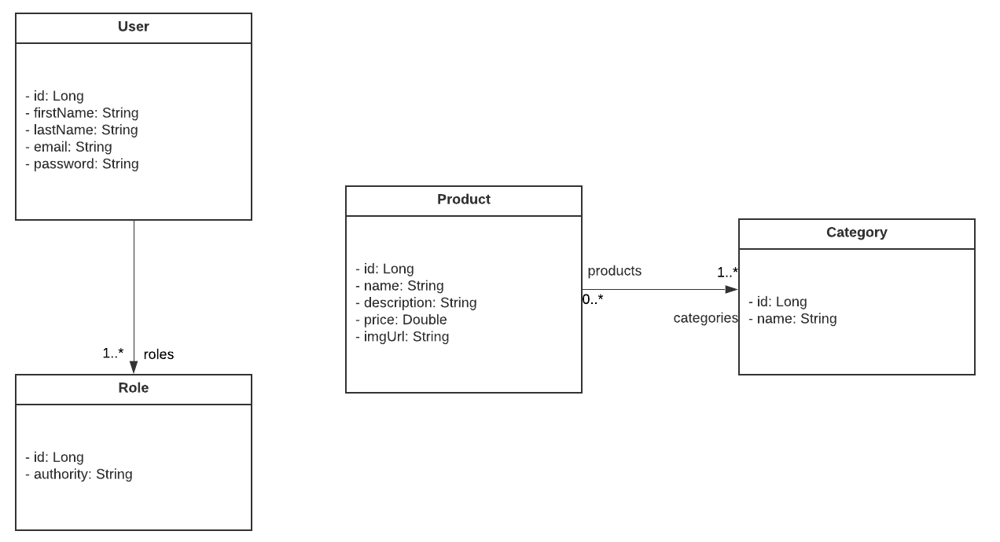

# FMRM | Catálogo de Produtos

	Catalog é uma aplicação full stack web que consiste em um catálogo de produtos que são armazenados em um banco de dados e exibidos no site web.

# Sobre o projeto

## Modelo conceitual

# Tecnologias utilizadas

## Back end

- Java
- Spring Boot
- JPA / Hibernate
- Maven

## Front end

- HTML / CSS / JS / TypeScript
- ReactJS

## Implantação em produção

- Back end: Heroku
- Front end web: Netlify
- Banco de dados: Postgresql

# Como executar o projeto

## Back end

## Front end web

# Autor

Fábio Monteiro

https://www.linkedin.com/in/fabiomrm
