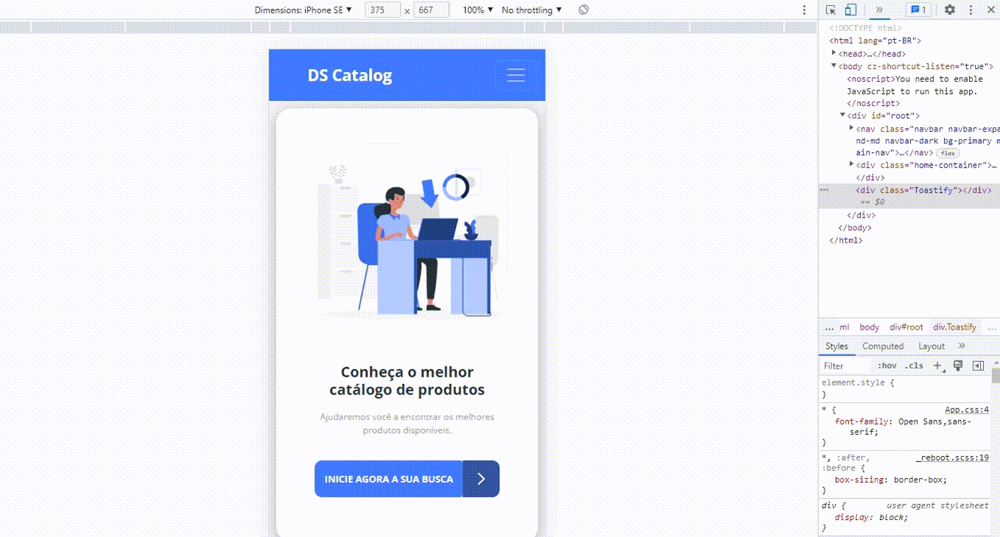

<h1 align="center">FMRM | Catálogo de Produtos</h1>

	Catalog é uma aplicação full stack web que consiste em um catálogo de produtos que são armazenados em um banco de dados e exibidos no site web. Qualquer pessoa pode visualizar os produtos, mas apenas administradores podem realizar operações no banco de dados da aplicação.

# Sobre o projeto

## Modelo conceitual

## Telas

### Home

\
\
\
\
\

# Catálogo

# Tecnologias utilizadas

## Back end

- Java
- Spring Boot
- JPA / Hibernate
- Maven

## Front end

- HTML / CSS / JS / TypeScript
- ReactJS

## Banco de dados

- PostgreSQL

## Implantação em produção

- Back end: Heroku
- Front end web: Netlify
- Banco de dados: Postgresql

## Sobre o proj

## Back end

## Front end web

### Autor

---

Feito por Fábio Monteiro 👋🏽 Entre em contato!

